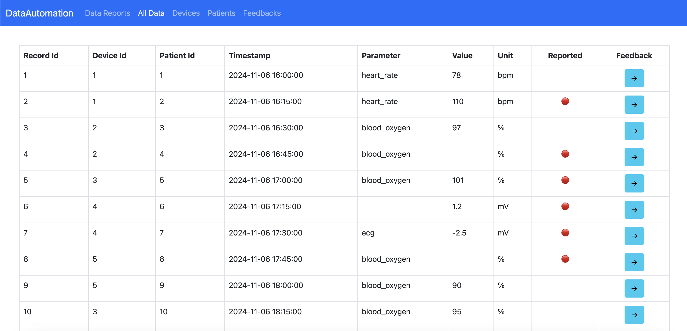

# Data-Automation
A data automation project for a Basel-based pharma company, enabling data validation, event logging, and anomaly alerts, while allowing users to provide feedback for continuous improvement.

## Roadmap
- Screenshot

- Prerequisites

- Getting Started

- Author

## Screenshot


## Prerequisites
- Python 3
- FastAPI
- SQLite
- React
- Vite

## Getting Started

### Install Backend Dependencies

```bash
pip install -r requirements.txt
```

### Set Up the Database
```bash
cd backend && python3 init_db.py
```

### Generate Fake Data (Optional)
```bash
cd backend && python3 fake_data.py
```

### Start the Backend Server
```bash
cd backend && uvicorn app:app --reload   
```

### Set Up the Frontend
```bash
cd frontend && yarn install
```

### Run the Frontend Application
```bash
cd frontend && yarn dev
```

## Author
- [Agni Ramadani](https://github.com/agniramadani)
